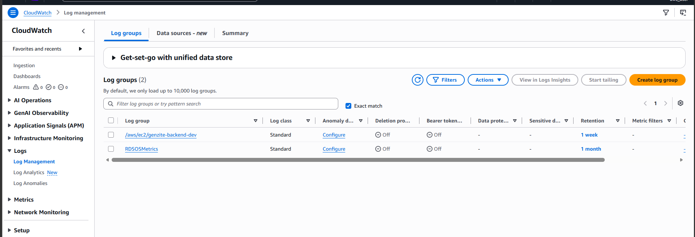
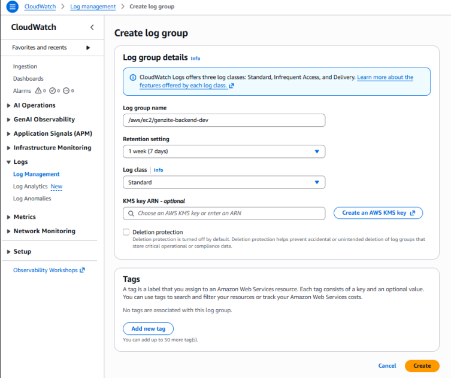

## Tổng quan

Trong phần này, chúng ta sẽ cấu hình và sử dụng **Amazon CloudWatch** để giám sát các tài nguyên của hệ thống Genzite, đặc biệt là tạo Log Group để thu thập log từ EC2 Backend và theo dõi các chỉ số hoạt động.

> **Lưu ý phân quyền:** Tác vụ thiết lập giám sát trên CloudWatch thuộc phạm vi chuyên môn của **User C (Application & Storage)**.

## Bước 1: Khởi tạo Log Group cho Backend

1. Mở AWS Management Console, tìm dịch vụ **CloudWatch**.
2. Ở menu bên trái, chọn **Logs** -> **Log groups**.
3. Nhấn vào nút **Create log group**.
4. Cấu hình các thông số như sau:
   - **Log group name**: `/aws/ec2/genzite-backend-dev`
   - **Retention setting**: `1 week (7 days)`
   - **Log class**: `Standard`
5. Nhấn **Create** để tạo nhóm log.

## Bước 2: Xem danh sách Log groups và dữ liệu Log

1. Sau khi tạo thành công, quay lại trang **Log groups**, bạn sẽ thấy danh sách các nhóm log (bao gồm `/aws/ec2/genzite-backend-dev` vừa tạo và có thể có cả `RDSOSMetrics` nếu đã cấu hình RDS).

2. Click vào Log group `/aws/ec2/genzite-backend-dev`.
3. Khi EC2 đẩy log lên qua CloudWatch Agent, bạn có thể click vào **Log stream** tương ứng để kiểm tra các luồng log (Lỗi, thông tin Request) đang đổ về.

## Bước 3: Tạo Alarm (Cảnh báo tự động)

1. Ở menu bên trái, chọn **Alarms** -> **In alarm**.
2. Nhấn **Create alarm**.
3. Chọn metric là **CPUUtilization** (Mức sử dụng CPU) của EC2 Backend.
4. Đặt ngưỡng cảnh báo (ví dụ: `> 80%` trong 5 phút liên tục).
5. (Tùy chọn) Cấu hình gửi thông báo qua Amazon SNS để gửi email cho quản trị viên khi hệ thống quá tải.

---
**Chúc mừng!** Bạn đã thiết lập thành công "trung tâm quan trắc" cho Genzite. Nhờ CloudWatch, đội ngũ có thể dễ dàng phát hiện và xử lý sự cố.
